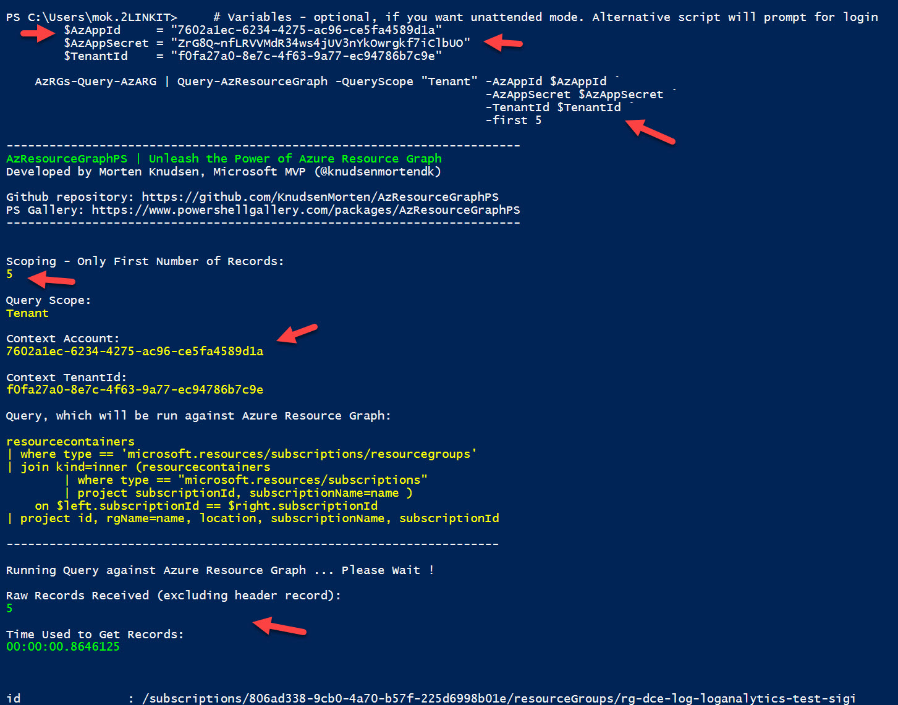

# AzResourceGraphPS
Think of this PS-module as a helper for doing **Azure Resource Graph Queries** using more than **+100 pre-defined queries** or you can make your own **custom queries**. You can connect using **Azure App** or through a **interactive login**. Solution supports **auto-update** so you will always have access to the latest queries, part of this solution.

[Teaser video (1:30 min)][Teaser]


## Quick Links

[Installation & Updating][Installation]

[Usage of Cmdlets][Usage]

[Troubleshooting][troubleshooting]

[Introduction to Azure Resource Graph &amp; PS-module AzResourceGraphPS (video, 15 min) ][IntroARG_PSModule]

[Query from Windows using AzResourceGraphPS (video, 12 min)][IntroPSModule]

[Query from Ubuntu using AzResourceGraphPS on powershell (video, 1:15 min)][Query-from-Ubuntu]

[Auto-updating of AzResourceGraphPS and Az.ResourceGraph (video, 30 sec)][Updating]

[Credit, Thank You][credit]

[How can you be mentioned with your cool queries][mention] 


[Installation]: #initial-installation-of-azresourcegraphps	"Installation"
[Usage]: #usage-of-query-azresourcegraph	"Usage"

[IntroARG_PSModule]: https://youtu.be/LnIolqDlJUc
[IntroPSModule]: https://youtu.be/d2Y09Dmi7FQ
[Query-from-Ubuntu]: https://youtu.be/RArx1iQ2aHo
[Updating]: https://youtu.be/qZLPzSn-YP4
[Credit]: #credits-for-queries
[Mention]: #how-can-you-be-mentioned-with-your-cool-queries-
[Troubleshooting]: #troubleshooting

[Teaser]: https://youtu.be/LjbcuA6vpq4


## Initial installation of AzResourceGraphPS

```
install-module AzResourceGraphPS -Scope AllUsers -Force
```

You can [find latest version of AzResourceGraphPS here (Github)](https://raw.githubusercontent.com/KnudsenMorten/AzResourceGraphPS/main/AzResourceGraphPS.psm1) - or from [Powershell Gallery using this link](https://www.powershellgallery.com/packages/AzResourceGraphPS)


## Optional: Automatic Auto-update & Clean-up Old Versions

After the initial installation, I encourage you to let AzResourceGraphPS auto-update. This can be done by running this command in a daily scheduled task:

```
Query-AzResourceGraph -InstallAutoUpdateCleanupOldVersions -Scope AllUsers
```

Advantage is primarily bugfixing + new feature - but more important: <u>you  will have access to the latest queries available and query-syntax fixes. A great way to stay on top of you queries.</u>


The following 3 tasks will be done:

* check if newer versions of **AzResourceGraphPS** is available. If Yes, it will install newest version and remove the older version(s)
* check if newer versions of **Az.ResourceGraph** is available. If Yes, it will install newest version and remove the older version(s)

 


## Usage of Query-AzResourceGraph


### Show query only (interactive mode)

```
Query-AzResourceGraph -ShowQueryOnly
```


### Select from list of pre-defined queries (interactive mode)

```
Query-AzResourceGraph
  -or-
Query-AzResourceGraph -SelectQuery
```


Example of output, where you can see the selected query from the previous list.


### Run pre-defined query against tenant - and output result to screen

```
AzMGsWithParentHierarchy-Query-AzARG | Query-AzResourceGraph -QueryScope Tenant
```


### Run pre-defined query against MG "2linkit"- and output result to screen

```
AzRGs-Query-AzARG | Query-AzResourceGraph -QueryScope MG -Target "2linkit"
```


### Run pre-defined query and return result to $Result-variable

```
$Result = AzMGsWithParentHierarchy-Query-AzARG | Query-AzResourceGraph -QueryScope "MG" `
                                                                     -Target "2linkit"
$Result | fl
```


### Run Custom Query and return result to $Result-variable

```
$Query = @"
            resourcecontainers 
            | where type == 'microsoft.management/managementgroups' 
            | extend mgParent = properties.details.managementGroupAncestorsChain 
            | mv-expand with_itemindex=MGHierarchy mgParent 
            | project id, name, properties.displayName, mgParent, MGHierarchy, mgParent.name 
            | sort by MGHierarchy asc
"@

$Result = $Query | Query-AzResourceGraph -QueryScope "Tenant"
$Result | fl
```


### Run query with initial interactive login

Start by running a Disconnect-AzAccount


### Run query using unattended login with AzApp & AzSecret

```
# Variables
$AzAppId     = "xxxx"
$AzAppSecret = "xxxx"
$TenantId    = "xxxx"

# Disconnect existing sessions
Disconnect-AzAccount

AzRGs-Query-AzARG | Query-AzResourceGraph -QueryScope "Tenant" -AzAppId $AzAppId `
                                                               -AzAppSecret $AzAppSecret `
                                                               -TenantId $TenantId
```




### Show only first x records

```
# Get all Azure Resource Groups in specific subscription - show only first 2 RGs
AzRGs-Query-AzARG | Query-AzResourceGraph -QueryScope Subscription `
                                          -Target "fce4f282-fcc6-43fb-94d8-bf1701b862c3" `
                                          -First 2
```


### Skip first x records

```
# Get all management groups under management group '2linkit' - skip first 3
AzMGsWithParentHierarchy-Query-AzARG | Query-AzResourceGraph -QueryScope "MG" `
                                                             -Target "2linkit" `
                                                             -Skip 3
```


## Troubleshooting


### Query Context can be wrong

Check the output for the Query Context Account to see which account the query runs under.

#### Interactive account (admin)


#### Azure app service principal


### Change Context

If you need to change the existing context, use the **Disconnect-AzAccount**. 

```
# Disconnect existing sessions
Disconnect-AzAccount
```


You can now make the query using either Azure App service principal or using interactive login.


## Credits for queries

The below people have contributed with their awsome queries included in AzResourceGraphPS - from the community to the community. 


### Billy York (@SCAutomation)

Github: https://github.com/scautomation/AzureResourceGraph-Examples

Blog: https://www.cloudsma.com/2021/01/azure-resource-graph-examples-repo/


### Wesley Hackman (@Whaakman)

Github: https://github.com/whaakman/azure-resource-graph-samples


### Wilfried Woivre (@Wilfriedwoivre)

Github: https://github.com/wilfriedwoivre/azure-resource-graph-queries

Blog: https://woivre.com/blog/2020/09/azure-resource-graph-community-samples


### Ludovic Alarcon (@alarco_l)

Blog: https://ludovic-alarcon.com/Resource-Graph-NodePool/


### Mohamed Barqawi (@barqawi_JO)


### Microsoft

https://learn.microsoft.com/en-us/azure/governance/resource-graph/samples/samples-by-table


## How can you be mentioned with cool queries ?

If you have some cool queries, that you would like to share with the community, I encourage you to send them to me through on of these channel:

* email on mok@mortenknudsen.net
* Twitter/X @knudsenmortendk
* LinkedIn https://www.linkedin.com/in/mortenwaltorpknudsen/


