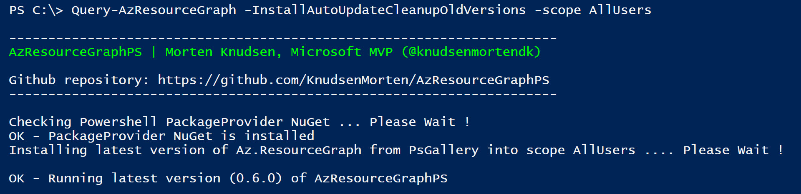
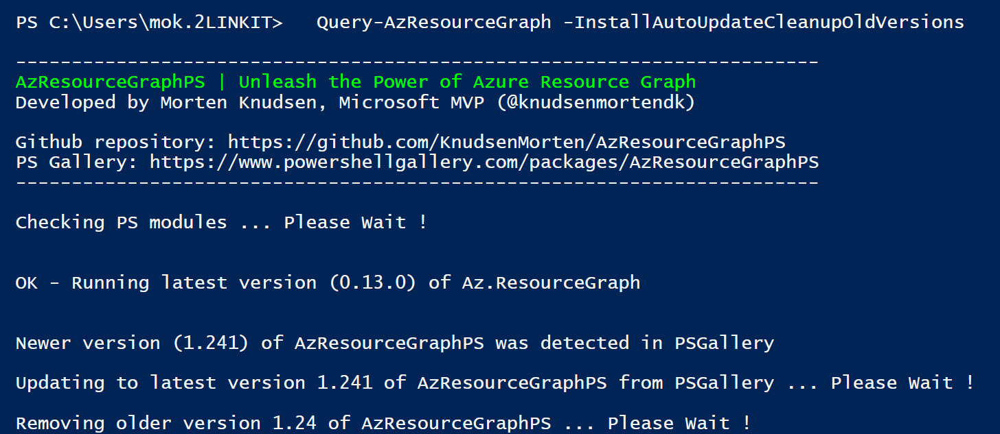
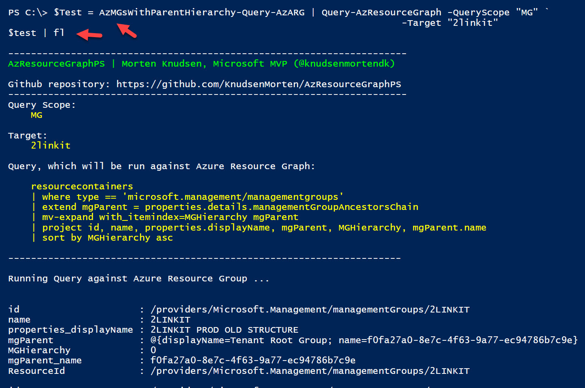

# AzResourceGraphPS
Think of this PS-module as a helper for doing **Azure Resource Graph Queries** using more than **+100 pre-defined queries** or you can make your own **custom queries**. You can connect using **Azure App** or through a **interactive login**. Solution supports **auto-update** so you will always have access to the latest queries, part of this solution.


[initial]: 	"Initial installation of AzResourceGraphPS"


## Initial installation of AzResourceGraphPS

```
install-module AzResourceGraphPS -Scope AllUsers -Force
```


You can [find latest version of AzResourceGraphPS here (Github)](https://raw.githubusercontent.com/KnudsenMorten/AzResourceGraphPS/main/AzResourceGraphPS.psm1) - or from [Powershell Gallery using this link](https://www.powershellgallery.com/packages/AzResourceGraphPS)


## Module Version-check with Auto-update & Clean-up old versions

After the initial installation, you can check if the pre-requisites with the needed PS-modules are OK using the below cmdlet.

Running the check will also auto-update **Az.ResourceGraph** and **AzResourceGraphPS** to latest version, if newer versions are detected. Lastly the cmdlet will remove any older versions of the required PS-modules, if found.

```
Query-AzResourceGraph -InstallAutoUpdateCleanupOldVersions -Scope AllUsers
```








## Usage of Query-AzResourceGraph


### Run pre-defined query against tenant - and output result to screen

```
AzMGsWithParentHierarchy-Query-AzARG | Query-AzResourceGraph -QueryScope Tenant
```


### Run pre-defined query against MG "2linkit"- and output result to screen

```
AzRGs-Query-AzARG | Query-AzResourceGraph -QueryScope MG -Target "2linkit"
```


### Run pre-defined query and return result to $Result-variable

```
$Test = AzMGsWithParentHierarchy-Query-AzARG | Query-AzResourceGraph -QueryScope "MG" `
                                                                     -Target "2linkit"
$test | fl
```




### Run Custom Query and return result to $Result-variable

```
$Query = @"
            resourcecontainers 
            | where type == 'microsoft.management/managementgroups' 
            | extend mgParent = properties.details.managementGroupAncestorsChain 
            | mv-expand with_itemindex=MGHierarchy mgParent 
            | project id, name, properties.displayName, mgParent, MGHierarchy, mgParent.name 
            | sort by MGHierarchy asc
"@

$Result = $Query | Query-AzResourceGraph -QueryScope "Tenant"
$Result | fl
```


### Show query only

```
AzMGsWithParentHierarchy-Query-AzARG | Query-AzResourceGraph -ShowQueryOnly
```


### Select from list of pre-defined queries

```
Query-AzResourceGraph -SelectQuery
```


Example of output, where you can see the selected query from the previous list.


### Run query with initial interactive login


### Run query using unattended login with AzApp & AzSecret

```
# Variables
$AzAppId     = "xxxx"
$AzAppSecret = "xxxx"
$TenantId    = "xxxx"

# Disconnect existing sessions
Disconnect-AzAccount

AzRGs-Query-AzARG | Query-AzResourceGraph -QueryScope "Tenant" -AzAppId $AzAppId `
                                                               -AzAppSecret $AzAppSecret `
                                                               -TenantId $TenantId
```


### Show only first x records

```
# Get all Azure Resource Groups in specific subscription - show only first 2 RGs
AzRGs-Query-AzARG | Query-AzResourceGraph -QueryScope Subscription `
                                          -Target "fce4f282-fcc6-43fb-94d8-bf1701b862c3" `
                                          -First 2
```


### Skip first x records

```
# Get all management groups under management group '2linkit' - skip first 3
AzMGsWithParentHierarchy-Query-AzARG | Query-AzResourceGraph -QueryScope "MG" `
                                                             -Target "2linkit" `
                                                             -Skip 3
```


## Troubleshooting


### Query Context can be wrong

Check the output for the Query Context Account to see which account the query runs under.

#### Interactive account (admin)


#### Azure app service principal


### Change Context

If you need to change the existing context, use the **Disconnect-AzAccount**. 

```
# Disconnect existing sessions
Disconnect-AzAccount
```


You can now make the query using either Azure App service principal or using interactive login.


## Credits for queries


### Billy York

Github: https://github.com/scautomation/AzureResourceGraph-Examples

Blog: https://www.cloudsma.com/2021/01/azure-resource-graph-examples-repo/


### Wesley Hackman

Github: https://github.com/whaakman/azure-resource-graph-samples


### Wilfried Woivre

Github: https://github.com/wilfriedwoivre/azure-resource-graph-queries

Blog: https://woivre.com/blog/2020/09/azure-resource-graph-community-samples


### Ludovic Alarcon

Blog: https://ludovic-alarcon.com/Resource-Graph-NodePool/


### Microsoft

https://learn.microsoft.com/en-us/azure/governance/resource-graph/samples/samples-by-table
